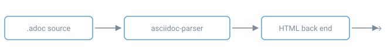

= adocers Showcase: Showing what we can do
Alexander Thaller <claude@thallerware.de>
v1.0, 2026-09-10: one page through every feature
:status: living document
:page-tags: asciidoc, rendering, showcase
:stem:
:toc: left
:toclevels: 3
:sectnums:
:experimental:
:description: Every block, list, table and diagram adocers knows how to render, \
with the AsciiDoc that produced it.

This document is written the way Asciidoctor's Writer's Guide is written: each
feature is explained, the AsciiDoc that produces it is shown, and the result
sits directly underneath. Rendering this file is therefore also the quickest way
to see whether a change to the renderer broke anything.

[source,console]
----
adocers resources/showcase.adoc          # writes resources/showcase.html
adocers serve resources                  # or read it in a browser
----

TIP: Everything below is rendered by the back end in `src/render/`.
`asciidoc-parser` renders inline content — bold, links, cross references — but
stops there: assembling blocks and documents is this tool's own work.

== The document header

Everything above the first paragraph is the document header: the title, who
wrote it, which revision it is, and whatever else the document has to say about
itself. This page's own header is

[source,asciidoc]
----
= adocers Showcase
Alexander Thaller <claude@thallerware.de>
v1.0, 2026-09-10: one page through every feature
:status: living document
:page-tags: asciidoc, rendering, showcase
:toc: left
:sectnums:
----

and what it produced is at the top of this page: a labelled line each for the
author, the revision, the status and the tags.

=== Author and revision

An author's address joins their name in angle brackets, the form you already
know from a commit or a mail header. Several authors share one line under a
plural label.

A revision can be written either way, and the two mean the same thing — the
line sets those attributes anyway:

[source,asciidoc]
----
v1.0, 2026-09-10: a remark    <1>

:revnumber: 1.0               <2>
:revdate: 2026-09-10
:revremark: a remark
----
<1> The revision line, on the line below the author.
<2> The same thing, written as the attributes it sets.

The version and the date are two facts and take a line each, so a document that
carries only one of them says only that one. The remark is a sentence about the
revision rather than another value belonging to it, so it is set apart below the
labels.

=== Other metadata

A header's attributes come in two kinds: facts about the document, and
instructions to the renderer. `:status:` is the first kind and `:sectnums:` the
second, and only the first is any use to a reader.

[cols="2,3"]
|===
|Written |Shown as

|`:status: implementing`
|Status: implementing

|`:page-tags: design, flux, ci`
|Tags, each as its own mark

|`:page-last-reviewed: 2026-01-01`
|Last reviewed: 2026-01-01

|`:keywords: alpha, beta`
|Keywords, each as its own mark

|`:sectnums:`, `:icons: font`, `:toc:`
|Nothing. These are settings.
|===

Anything in Antora's `page-` namespace is shown with the prefix dropped, so
`:page-tags:` reads as `Tags`. Beyond that the names shown are `status`,
`keywords`, `category`, `edition`, `organization` and `copyright`.

That is an allowlist rather than a blocklist, so an attribute nobody thought
about is left out rather than shown by accident. To show one that is not on it,
put it in the `page-` namespace:

[source,asciidoc]
----
:page-supersedes: 0019
----

A list of tags or keywords is a set of separate things that happens to be
written with commas, so each is shown as its own mark rather than run together
into a sentence.

== Text

=== Inline formatting

Text carries the usual marks. `+*bold*+`, `+_italic_+`, `+`monospace`+`,
`+#highlighted#+`, `+^super^+` and `+~sub~+` all behave as you would expect,
and doubling the delimiter applies a mark inside a word.

[source,asciidoc]
----
*bold*, _italic_, `monospace`, #highlighted#, ^super^ and ~sub~,
un**frigging**believable, and `*monospaced bold*`.
----

*bold*, _italic_, `monospace`, #highlighted#, ^super^ and ~sub~,
un**frigging**believable, and `*monospaced bold*`.

A pair of `+` signs passes text through untouched, which is how the delimiters
above appear in this paragraph at all. Three of them, `+++<b>like this</b>+++`,
pass raw HTML straight to the page.

WARNING: Passthroughs and attribute references emit unescaped HTML *by design*.
If you render AsciiDoc you did not write and serve the result to other people,
run it through a sanitizer such as `ammonia` first. Safe mode does not cover
this: it governs how far a document may reach outside itself, not what it may
put on the page.

=== Punctuation and escaping

AsciiDoc curves the quotation marks you write as "`double`" and '`single`', and
turns Sam's apostrophe the right way round. It also spells out the marks that
are awkward to type: (C) (R) (TM), an em dash --, an ellipsis ..., and the
arrows -> => <- <=.

A backslash turns any of it off. \*not bold*, \_not italic_, \`not monospace`
and \{not-an-attribute} all reach the page as written.

The `pass:[pass:]` macro is finer-grained than a passthrough: it names which
substitutions to run and skips the rest. pass:[<u>Nothing at all</u>] passes
straight through, pass:q[<u>while *this* keeps its quotes</u>], and a block can
ask for one back with `+[subs=+attributes]+`.

A line ends with a space and a `+` to break without ending the paragraph +
like that. `[%hardbreaks]` does it for every line of a block at once:

[%hardbreaks]
One line
another line
a third.

=== Anchors and inline images

[[an-anchor]]Any paragraph can carry an anchor, which is what `<<an-anchor,a
cross reference>>` points at.

An icon or a mark can sit in a line of text — image:showcase-figure.svg[A
figure,120,18] — with the same attributes a block image takes.

=== Links, references and footnotes

A bare URL such as https://asciidoc.org becomes a link, and
https://asciidoc.org[the syntax reference] gives it a label. Cross references
point at a section by its ID: <<tables>> and <<_admonitions>> both work, the
first because that section carries an explicit anchor.

Footnotes collect at the foot of the page.footnote:[Like this one. The
definitions are gathered into a `#footnotes` block, so every reference in the
body has something to link to.]

=== Attributes

Attributes set in the header are substituted wherever they are referenced.
Because this document sets `+:experimental:+`, the UI macros work too: press
kbd:[Ctrl+S] to save, click btn:[Apply], then choose menu:File[Export > HTML].

Character references such as `+&#8594;+` (&#8594;) and the built-in
`+{nbsp}+`, `+{mdash}+` and `+{zwsp}+` are available. Setting an attribute on
the command line with `-a name=value` locks it, so the document cannot override
what you asked for.

== Lists

=== Unordered

* first level
** second level
*** third level
+
A block attached with a `+` continuation.

A style names the bullet, or takes it away:

[square]
* `[square]`, `[circle]` and `[disc]` name a bullet
* `[none]` and `[no-bullet]` take it away
* `[unstyled]` takes the indent too

[inline]
* `[inline]`
* runs the items
* along one line

=== Checklists

[source,asciidoc]
----
* [x] finished
* [ ] not finished
----

* [x] finished
* [ ] not finished
* an item with no box is an ordinary item that happens to share the list

=== Ordered

An ordered list is numbered by how many dots its marker has: one for arabic,
two for lower alpha, three for lower roman, four for upper alpha, five for
upper roman.

. arabic
.. lower alpha
... lower roman
.... upper alpha
..... upper roman

A style overrules the depth, which is the only way to reach `[decimal]` and
`[lowergreek]` at all:

[lowergreek]
. lower greek
. numbering

`[start=N]` begins somewhere other than one, and `[%reversed]` counts down.

[start=7]
. seven
. eight

[%reversed]
. three
. two
. one

=== Description lists

Term:: The definition that follows it.
Another term:: Its own definition, which can carry
+
--
An attached block, if the definition needs one.
--

Terms written one after another share the definition below them:

First spelling::
Second spelling:: Both mean this.

`[horizontal]` sets the terms beside their definitions, and `labelwidth` and
`itemwidth` fix the two columns:

[horizontal,labelwidth=20,itemwidth=50]
CPU:: Central processing unit
RAM:: Random access memory
NIC:: Network interface controller

`[qanda]` numbers the terms as questions:

[qanda]
What is AsciiDoc?:: A plain-text writing format for structured documents.
Why not Markdown?:: Because tables, admonitions, includes and cross references
are part of the language rather than of each tool's dialect.

== Blocks

=== Listings and source

A `----` block is verbatim. Adding a language highlights it, with tree-sitter
grammars compiled into the binary — so the colours are markup in the page rather
than the work of a script in the reader's browser.

[source,rust]
----
fn main() {
    let parser = Parser::default();          // <1>
    let document = parser.parse(source);     // <2>
    println!("{}", render(&document, &options));
}
----
<1> Callouts attach to the lines they mark.
<2> The list beneath the block carries the same marks, and both survive
highlighting. `--no-icons` writes them as `(1)` instead of drawing them.

Because a grammar knows what it is reading, `fn` is a keyword where Rust means
one and ordinary text where it does not — inside the string and the comment
below, a highlighter matching words would have coloured both.

[source,python]
----
def describe(fn):        # "fn" here is a parameter, not a keyword
    return f"fn {fn}"    # and here it is part of a string
----

The languages with a grammar compiled in are AsciiDoc's usual suspects:
`rust`, `python`, `javascript`, `typescript`, `tsx`, `go`, `c`, `bash`, `java`,
`json`, `toml`, `yaml`, `html` and `css`. The names people actually write are
understood too — `rs`, `py`, `js`, `ts`, `sh`, `console`, `yml` and so on — and
a language with no grammar is simply left plain:

[source,go]
----
func main() {
    ch := make(chan int, 1)
    go func() { ch <- 42 }()
    fmt.Println(<-ch)
}
----

[source,yaml]
----
name: adocers
on: [push]
jobs:
  build:
    runs-on: ubuntu-latest    # a comment
----

Every block keeps its `language-…` class either way, so a page can still be
highlighted in the browser if you would rather. `--no-highlight` leaves the code
plain, and a build without the `highlight` feature has no grammars in it at all.

=== Literal blocks

A `....` block keeps its spacing and applies no substitutions at all.

....
  literal   text   keeps   every   space
  and every line break
....

=== Quotes and verses

[quote,Ursula K. Le Guin,The Left Hand of Darkness]
____
Light is the left hand of darkness, and darkness the right hand of light.
____

A verse keeps the line breaks the author wrote:

[verse,Anonymous]
____
Roses are red,
  violets are blue,
    this block is preformatted
      and so is this line too.
____

=== Examples

An example groups content and, when it carries a title, is numbered.

.An example block
====
The caption counts up through the document, and `:example-caption:` renames it
— or unsets it, if you would rather the title stood alone.
====

`[%collapsible]` turns an example into a disclosure widget, with its title as
the summary rather than a heading above it. `%open` starts it open.

.A collapsible example
[%collapsible]
====
The reader gets the whole block only if they ask for it, which suits an aside
that most readers can skip: the full output of a command, or the long form of
an argument the surrounding text summarises.
====

=== Sidebars

A sidebar holds an aside — related material that would interrupt the sentence
it sits beside. Its title lives inside the box rather than above it.

.A sidebar with a title
****
A sidebar can hold anything a document can. This one holds an admonition and a
source block.

TIP: Nested blocks keep their own shape.

.And a listing, inside
[source,js]
----
const aside = "content that would interrupt the main text";
----
****

When there is only one paragraph to set aside, the style can go above it and
the delimiters can be dropped:

[source,asciidoc]
----
[sidebar]
One paragraph, no delimiters.
----

[sidebar]
One paragraph, no delimiters.

=== Open blocks

An open block groups content without implying anything about it. It is the
block to reach for when several paragraphs have to travel together — attached
to a list item, say — and none of the other blocks would be telling the truth.

--
An open block, holding two paragraphs.

Neither of which is styled in any particular way.
--

Given a style, a `--` block becomes whatever the style names. That saves
remembering which delimiter goes with which block, and it is the only way to
write some of them inside a list item:

[source,asciidoc]
------
[sidebar]
--
This is a sidebar, written with open block delimiters.
--
------

[sidebar]
--
This is a sidebar, written with open block delimiters.
--

`[quote]`, `[verse]`, `[literal]`, `[listing]`, `[source]`, `[example]` and
`[abstract]` all work the same way. Any other style is simply put on the block
as a class, for a stylesheet to find:

[abstract]
--
An abstract is set as a quotation, which is how Asciidoctor distinguishes the
summary of a document from the body of it.
--

=== Passthroughs, comments and breaks

A `pass:[++++]` block goes to the page untouched, which is the escape hatch for
markup AsciiDoc has no syntax for:

++++

  Raw HTML, passed through as written.

++++

A `////` block is a comment and reaches the page as nothing at all. So does a
single `//` line.

////
None of this is rendered.
////

A `'''` line is a thematic break:

'''

A `<<<` line is a page break. It emits a hint for print stylesheets and shows
nothing on screen.

=== Mathematics

With `:stem:` set, a `[stem]` block is an equation. It is converted here, while
the page is rendered, into MathML — which browsers draw themselves. The page
carries the equation and loads nothing to show it.

`:stem:` on its own means AsciiMath, which is what this one is written in:

[stem]
++++
a^2 + b^2 = c^2
++++

`[latexmath]` and `[asciimath]` say which notation a block is in, whatever
`:stem:` was set to. LaTeX is the better supported of the two here — sums,
integrals, matrices and limits all come out right, where AsciiMath is handled
more roughly:

[latexmath]
++++
\sum_{i=1}^{n} i = \frac{n(n+1)}{2}
++++

[latexmath]
++++
C = \alpha + \beta Y^{\gamma} + \epsilon
++++

`--no-math` leaves an equation as the notation it was written in, which is also
what happens to one the converter cannot read. A build without the `math`
feature does the same.

[#_admonitions]
== Admonitions

Five kinds, each marked with an icon that takes its colour from the page and
carries its label as an accessible name. `--no-icons` goes back to the
uppercase text labels Asciidoctor emits when `+:icons:+` is not set.

NOTE: Something worth knowing that is not essential to the task.

TIP: A better way of doing what you are already doing.

IMPORTANT: Something you should not miss, though nothing breaks if you do.

CAUTION: Proceeding carelessly here risks losing work.

WARNING: This one can damage something that is hard to put back.

.An admonition with a title and several blocks
[NOTE]
====
The delimited form holds as much as you like.

* including lists
* and anything else
====

== Diagrams

A block written as `[mermaid]` or `[source,mermaid]` is drawn as a diagram.
Both spellings are recognized, because a document that has to render here *and*
on GitHub usually picks between them with an attribute.

[source,asciidoc]
------
[mermaid]
----
flowchart LR
    A --> B
----
------

The diagram is drawn here, while the page is rendered, so the page carries it
as an `<svg>` and fetches nothing to show it — no drawing module, no script, no
wait. It takes your colour scheme, and is drawn to the width of the column and
no wider, so it is there to be read rather than to be scrolled at, and it
narrows with the column on a small screen. Images do the same.

Mermaid draws a good deal more than the four kinds below; these are the ones
this page has a use for.

=== Flowcharts

Boxes and arrows, laid out left to right with `LR` or top to bottom with `TB`.
A label on an arrow is written between the dashes.

[mermaid]
----
flowchart LR
    SRC[".adoc source"] --> PARSE[asciidoc-parser]
    PARSE --> TREE[block tree]
    TREE --> HTML[HTML back end]
    HTML --> PAGE[page]
    HTML -- "--fragment" --> FRAG[body only]
    PARSE -- warnings --> DIAG[ariadne diagnostics]
----

=== Sequence diagrams

Participants across the top, time down the page, and a message for every arrow
between them.

[mermaid]
----
sequenceDiagram
    participant B as Browser
    participant S as adocers serve
    participant F as File system
    B->>S: GET /guide.adoc
    S->>F: read guide.adoc and its includes
    S-->>B: rendered HTML
    B->>S: GET /__adocers/reload?generation=4
    Note over S: held open until something changes
    F-->>S: guide.adoc written
    S-->>B: 5
    B->>B: location.reload()
----

A sequence diagram can also branch and repeat. `loop`, `alt` and `opt` draw the
frames around the messages they hold, and `+` and `-` on an arrow mark where a
participant is busy:

[mermaid]
----
sequenceDiagram
    participant R as Reader
    participant S as adocers serve
    loop every render
        R->>+S: GET /guide.adoc
        alt document parses
            S-->>R: 200 and the page
        else it does not
            S-->>R: 500 and the diagnostic
        end
        opt the page has a diagram
            R->>S: GET the drawing module
        end
        S-->>-R: done
    end
----

=== Pie charts

A title and a list of labelled numbers. The percentages are worked out for you.

[mermaid]
----
pie title What a documentation page is made of
    "Prose" : 60
    "Source blocks" : 25
    "Tables" : 10
    "Diagrams" : 5
----

=== Git graphs

Branches and merges, drawn from the commands that made them.

[mermaid]
----
gitGraph
    commit id: "parser"
    commit id: "back end"
    branch highlight
    commit id: "tree-sitter"
    commit id: "callouts"
    checkout main
    merge highlight
    commit id: "diagrams"
----

[#tables]
== Tables

A table's columns are described by `cols`, and `options` says which rows are
special.

[source,asciidoc]
------
[cols="1,2,1",options="header,footer",stripes=even]
|===
|Name |Description |Count
|Alpha |The first entry |1
|===
------

.A table with a header and a footer
[cols="1,2,1",options="header,footer",stripes=even]
|===
|Name |Description |Count

|Alpha
|The first entry
|1

|Beta
|The second entry
|2

|Total | |3
|===

The footer row above leaves its middle cell empty. An empty cell is still a
cell: it keeps its borders and its place in the row, and simply holds nothing.

=== Columns

The numbers in `cols` are relative, not percentages: `1,2,1` gives the middle
column half the table and the outer two a quarter each, and `2,4,2` says the
same thing. They are turned into percentages to four decimal places and then
made to add up, with the last column taking whatever the rounding left over, so
three equal columns come to exactly 100% rather than a hair under it.

`N*` repeats a spec. `cols="4*"` is four equal columns, and a spec written
after the `*` applies to all of them.

A column can carry its own alignment: `<` `^` `>` place the content left,
centre and right, and `.<` `.^` `.>` place it top, middle and bottom.

[source,asciidoc]
----
[cols="<1,^1,>1,.^1"]
----

.Alignment declared once per column rather than on every cell
[cols="<1,^1,>1,.^1"]
|===
|Left, the default |Centred |Right |Middle

|A cell's own specifier still wins over its column's.
^|centred anyway
|.
|Vertically centred against the tall cell beside it.
|===

A `~` column is measured by the browser from what is in it. The numbers beside
it stop being shares of the table and become the percentages they are written
as, since there is no longer a whole for them to be shares of:

.One column left to the browser
[cols="20,~,20"]
|===
|20% |Whatever is left |20%

|Fixed |Measured from its content |Fixed
|===

=== Cells

Cells carry a specifier before the `|`. `^` `>` `<` align the content, `2+`
spans two columns, `.2+` spans two rows, and a letter picks the cell style:
`e` emphasis, `s` strong, `m` monospace, `l` literal, `h` header.

.Alignment, spans and cell styles
[cols="1,1,1",frame=ends,grid=rows]
|===
^|centred >|right <|left

2+|this cell spans two columns |ordinary

.2+|and this spans two rows e|emphasis s|strong
m|monospace l|literal
|===

An `a` cell is a document in its own right:

.An AsciiDoc cell
[cols="1,1"]
|===
|Plain |AsciiDoc

|Just text.
a|
* A list
* inside a cell

NOTE: And an admonition.
|===

=== Frame, grid and width

`frame` draws the border around a table — `all`, `ends`, `sides` or `none` —
and `grid` draws the rules between its cells: `all`, `rows`, `cols` or `none`.
Between them they decide how much of a grid a table looks like.

.`frame=sides` with `grid=cols`, so the rules all run one way
[frame=sides,grid=cols,cols="1,1,1"]
|===
|one |two |three
|four |five |six
|===

.`frame=none` with `grid=none`, which is a layout rather than a table
[frame=none,grid=none,cols="1,1,1"]
|===
|one |two |three
|four |five |six
|===

A table fills the page unless it is told not to. `[width=NN%]` sets how much of
it to take:

.`[width=40%]`
[width=40%]
|===
|Narrow |Table
|===

`[%autowidth]` sizes a table to its content instead of the page, which suits a
short table of terms:

[%autowidth]
|===
|Flag |Effect

|`--fragment` |Body only
|`--watch` |Re-render on change
|===

`stripes` shades alternating rows — `even`, `odd`, `all`, `hover` or `none` —
and `caption` replaces the label in front of a table's title.

.A table numbered by hand
[stripes=odd,caption="Figure B. ",cols="1,1"]
|===
|`stripes=odd` |shades the first row
|`caption=` |replaces `Table 1. `
|===

=== Data as a table

A table's rows do not have to be written as AsciiDoc. `format=csv` reads them
as comma-separated values, which is what a spreadsheet or a query already
gives you:

[source,asciidoc]
------
[format=csv,options=header,cols="2,1,1"]
|===
Grammar,Extensions,Injected
Rust,rs,no
HTML,"html,htm",yes
|===
------

.Comma-separated rows
[format=csv,options=header,cols="2,1,1"]
|===
Grammar,Extensions,Injected
Rust,rs,no
HTML,"html,htm",yes
Markdown,"md,markdown",no
|===

Quoting a field is how a value keeps a comma of its own, as `"html,htm"` does
above. `format=dsv` splits on `:` instead, and `separator=` names any other
character:

.Colon-separated rows, the format `/etc/passwd` is written in
[format=dsv,options=header,cols="1,1,2"]
|===
Field:Kind:Meaning
1:name:The account name
2:uid:Its numeric id
|===

== Images and media

An image with a title is captioned and numbered as a figure.

.How a document becomes a page

An image's `link` attribute makes the figure itself a link, and `alt` text is
derived from the file name when you do not give any.

Video and audio have their own macros. They are shown here as source rather
than rendered, because this repository carries no media file to point them at:

[source,asciidoc]
----
video::clip.mp4[width=640,poster=thumb.png]
audio::interview.ogg[]
----

== Includes

An `include::` directive pulls another file in at the point it appears. What
follows this paragraph comes from `showcase-included.adoc`:

include::showcase-included.adoc[]

Includes are resolved relative to the file that contains the directive, and
`--safe-mode safe` or stricter confines them to the document's own directory.
`lines`, `tags`, `leveloffset` and `indent` all work, and the files an include
brings in are tracked, so `--watch` and `serve` notice when one of them changes.

== Diagnostics

Parsing AsciiDoc never fails — every UTF-8 string is a valid document — so
everything the parser has to say arrives as a warning against a span of the
source:

....
[UnterminatedDelimitedBlock] Warning: closing marker for delimited block not found
    ╭─[ showcase.adoc:214:1 ]
    │
214 │ ----
    │ ──┬─
    │   ╰─── closing marker for delimited block not found
────╯
....

Warnings never stop a render; the HTML is written regardless. `--deny-warnings`
makes them fail the run instead, and `-v` adds the low-severity diagnostics that
are hidden by default.

Spans are measured against the document *after* `include::` expansion, which is
what the parser measured, so the underline always lands on the right bytes. When
a warning comes from an included file, a note names the file and line it really
came from.

== PDF output

Naming the output `.pdf` typesets the document instead of rendering it as a
page. There is no separate flag: the name already says which is wanted.

[source,console]
----
adocers -o showcase.pdf showcase.adoc
----

The typesetter is https://typst.app[Typst], compiled into this binary, so a PDF
needs no LaTeX installation, no headless browser and nothing fetched. The fonts
are the ones Typst carries, so the same document gives the same PDF wherever it
is run. This page takes about 90 ms.

Almost everything on this page survives the crossing: headings and their
numbers, lists, tables with their spans and footers, admonitions with their
icons, quotes and verses, listings with their highlighting and their callouts,
images and the page breaks below. A `:toc:` becomes a real outline, with a page
number against every entry; a `footnote:[]` becomes a real footnote, at the foot
of the page its reference landed on. The diagrams are drawn into it as vector
graphics rather than pictures of diagrams, so they are as sharp printed as they
are here.

An equation written in LaTeX is typeset. Typst's mathematics syntax is neither
LaTeX's nor AsciiMath's, so an equation cannot be handed over as it stands;
https://crates.io/crates/mitex[mitex] translates it on the way. AsciiMath is not
translated and is shown as its source, because it looks close enough to Typst to
be passed through and is not — `int_0^1` is an integral in one and the
whole-number type in the other. If the translation of some equation will not
typeset, the whole document is rendered again with every equation shown as its
source, rather than not rendered at all.

Three things are deliberately left short:

A table cell written as AsciiDoc comes out empty:: A cell holding whole blocks
is more structure than a printed table wants.

Passthroughs are dropped:: They are HTML, which a PDF has no use for.

A cross reference to anything but a section becomes plain text:: Typst will not
lay out a document that links to a label it cannot find, so a reference that
would dangle keeps its words and loses its link.

[appendix]
== The command line

`adocers` renders files, and `adocers serve` shows a directory in a browser.

[source,console]
----
adocers doc.adoc                 # writes doc.html beside it
adocers -o build/ *.adoc         # writes build/<name>.html
adocers -o - doc.adoc            # writes to standard output
adocers -o doc.pdf doc.adoc      # writes a PDF instead
adocers --watch docs/*.adoc      # re-renders on change
adocers serve ./docs             # http://127.0.0.1:8080/
----

[cols="1,2"]
|===
|Flag |Effect

|`--fragment`
|Body only — no page, no header or footer — for embedding elsewhere.

|`--css FILE` / `--no-css`
|Replace the built-in stylesheet, or leave the page unstyled.

|`-a NAME=VALUE`
|Set a document attribute the document cannot override. Repeatable.

|`--no-icons`
|Mark admonitions with their label rather than an icon.

|`--no-mermaid` / `--no-math`
|Leave diagrams and equations as the source they were written as.

|`--safe-mode MODE`
|`unsafe` (default), `safe`, `server` or `secure`.

|`--deny-warnings`
|Exit non-zero if anything was reported.
|===

[appendix]
== Serving a directory

`serve` renders each document when it is requested. Nothing is built ahead of
time and nothing is left behind.

A request for a directory is answered with the first `--index-file` present in
it — `INDEX.adoc`, then `README.adoc` — and otherwise with a browsable listing.
Adding `raw` to the query serves a document's source instead of its rendering,
so a page and the AsciiDoc behind it are one query parameter apart:

`format` asks for one of the forms it can be rendered into, so the typeset
document is one parameter away as well:

[source,console]
----
http://localhost:8080/showcase.adoc             # this page
http://localhost:8080/showcase.adoc?raw         # the AsciiDoc behind it
http://localhost:8080/showcase.adoc?format=pdf  # the same document, typeset
----

Every page carries a script that reloads it when anything under the served
directory changes. The page holds the value of a counter and asks the server for
the current one; the server does not answer until the two differ. So a change
reaches the browser as soon as the file system reports it, with no polling in
between.
